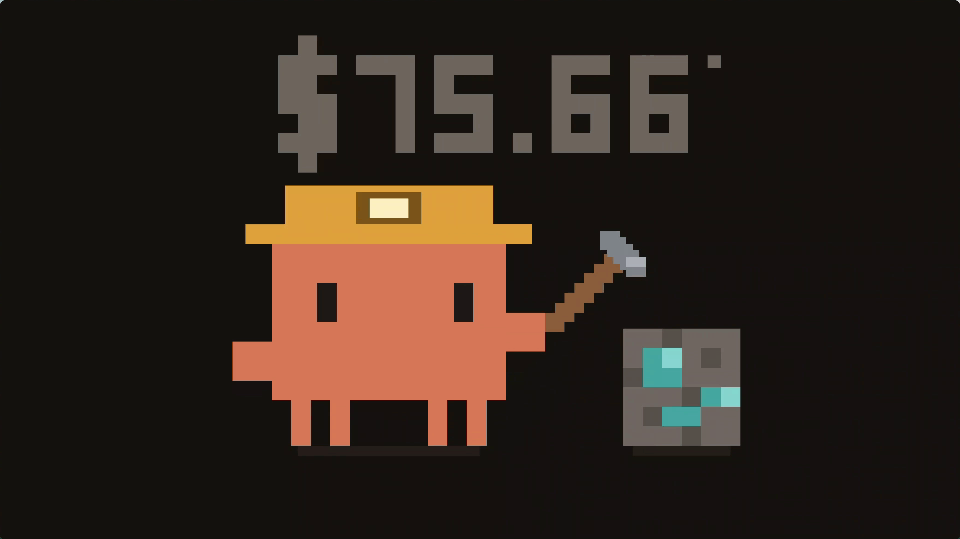

# Clawd Saver

A Windows screensaver that shows today's Claude Code spend while Clawd mines for it.



| Path | What it is |
|---|---|
| `saver/` | The screensaver: a Rust binary that embeds the page and reads ccusage. |
| `saver/src/ui.html` | The whole visual. Open it in any browser — with no host to feed it, the counter just reads `$--.--`. |
| `checks/` | Non-visual verification for `ui.html`. |
| `docs/` | Design and build notes, plus the recording above. |

## Install

```powershell
.\install.ps1                 # build, install, register (5 min idle)
.\install.ps1 -Timeout 10     # 10 minutes instead
.\install.ps1 -Uninstall      # remove it again
```

Everything lands under `%LOCALAPPDATA%\clawd-saver\` and `HKCU:\Control Panel\Desktop`.
No administrator rights required.

The Windows screensaver dropdown only lists `.scr` files that live in `System32`,
so this one will not appear there. It still runs on idle — Windows reads the path
from the registry, not from the dropdown. Pass `-System` from an elevated prompt
if you want it in the list.

## How it works

Rust + [`tao`](https://crates.io/crates/tao) + [`wry`](https://crates.io/crates/wry) —
the window and webview crates that Tauri is built on, used directly without the
Tauri framework, CLI, bundler, or IPC layer. WebView2 ships with Windows 11, so
nothing is bundled. The release binary is **622 KB**.

The page is embedded with `include_str!`, so the `.scr` is a single self-contained
file.

### Two things that were not obvious

**WebView2 eats the input.** It covers the whole window and consumes mouse and
keyboard events before tao's event loop sees them. A screensaver that cannot
detect input never closes. The exit trigger therefore lives in an injected script
inside the page and comes back over IPC. It ignores the first 600 ms and requires
8 px of real cursor travel, because Windows sometimes emits a phantom `mousemove`
the instant the saver appears.

**There is no exit on focus loss** — deliberately. It is not part of the
screensaver contract, and it self-destructs on multi-monitor setups: creating the
second window blurs the first, which would quit before anyone saw it.

### Data

`ccusage` is pinned to a version rather than `@latest`, which would re-resolve
against the npm registry on every run and fail offline. Runners are tried in
order and the first one that works wins:

```
ccusage                          (global install, if present — skips ~4.6s)
pnpx ccusage@20.0.19
npx -y ccusage@20.0.19
%LOCALAPPDATA%\pnpm\pnpx.CMD     (in case the saver inherits a thin PATH)
```

Measured on the development machine: `pnpx` alone costs most of the time in
package resolution and node startup before ccusage does any work. A refresh takes
**about 4 seconds on an idle machine and up to 9 under load**. Far too slow to
block the first frame, so the counter is seeded from
`%LOCALAPPDATA%\clawd-saver\last.json` and updated when the fetch lands. The
cache is keyed by date — yesterday's total is never shown as today's.

Refresh runs every **10 seconds**, and the poller sleeps only the remainder of
the interval rather than the whole of it — a flat sleep after a 4–9 s fetch would
stretch the cadence to 14–19 s.

That is close to the floor for this design: node is running roughly 40–80% of the
time the saver is up, depending on machine load. Installing ccusage globally
(`pnpm add -g ccusage`) skips the `pnpx` resolution step entirely and roughly
halves the fetch, which is the single best way to bring that down. The runner
chain already prefers a global install when it finds one.

Change the cadence in `saver/src/saver.rs`:

```rust
const REFRESH: Duration = Duration::from_secs(10);
```

### When the counter will not fill in

A screensaver has no console, so `%LOCALAPPDATA%\clawd-saver\log.txt` is the only
place to see what happened. One line per session and per fetch:

```
2026-08-06 09:36:48  saver start   1 display(s), seed=none
2026-08-06 09:36:51  fetch ok         2.3s  via pnpx  $69.70
2026-08-06 09:36:52  fetch FAILED     0.9s
    ccusage: exit code: 1 - 'ccusage' is not recognized ...
    PATH=C:\Windows\System32
```

`via` is the part to read first. A fetch through `pnpx` costs ten to twenty
seconds — most of it package resolution, not ccusage — and the first run of a
day is worse because the dlx cache has to be rebuilt. That is long enough that
the saver gets dismissed before the figure ever lands, which reads as a counter
stuck on `$--.--`.

`pnpm add -g ccusage` removes that entirely. The runner chain already prefers a
global install, so nothing else has to change; measured here it took a fetch from
13s to under 1s.

The log is capped and trims itself.

## Command line

Windows passes `/s`, `/c`, `/c:<hwnd>`, or `/p <hwnd>`. A bare invocation means
config.

`/p` — the settings-dialog thumbnail — is deliberately unimplemented and exits
immediately, leaving the preview black. Standing up a WebView2 instance in a
postage-stamp pane costs far more than it is worth.

Development switches:

| Flag | Effect |
|---|---|
| `--windowed` | Ordinary 1280×800 window instead of taking over every display |
| `--exit-after <ms>` | Quit on a timer, for unattended checks |
| `--ignore-input` | Do not wire up the input exit, so a screenshot can be taken |
| `--diag` | Have the page report viewport metrics over IPC |
| `--print-usage` | Run the ccusage pipeline once and print. Debug builds only — release is a GUI subsystem binary with no stdout. |

```powershell
cd saver
cargo run -- --windowed
cargo run -- --print-usage
```

## Rendering notes

Everything is drawn as axis-aligned rectangles on a 112×70 unit grid, scaled to an
**even integer** number of device pixels per unit. Even, because the arms are 7.5
units wide and half-units still have to land on whole pixels.

All motion is quantised to whole units. Sub-pixel movement would smear the block
edges the character is made of. The pickaxe swing is four discrete poses rather
than a rotation, for the same reason — `ctx.rotate()` would destroy the grid.

Diagonals need care. Stepping a 3-unit block by a full 3 units along a diagonal
makes consecutive blocks meet at their corners only, and the result reads as a
row of loose squares rather than a shaft. `blockLine()` walks the line at
half-block spacing and snaps to the half-unit grid, so the pickaxe stays solid at
every angle. `checks/verify-ui.js` asserts that consecutive blocks actually
overlap, not just that they are in bounds.

On a near-black background there is nothing darker to cast a shadow with, so the
ground under Clawd and the ore is a faintly *lighter* bar instead.

Burn-in protection drifts the whole scene by a few whole units every half minute.

The process calls `SetProcessDpiAwarenessContext` before creating any window.
Without it WebView2 reports `innerWidth` in physical pixels while
`devicePixelRatio` still claims 1.5, and any canvas sizing that multiplies the two
double-counts the scale factor and overflows the screen.

## Verification

```powershell
node checks/verify-ui.js      # every rect, 4 poses x 5 drift offsets, in bounds
node checks/smoke-ui.js       # executes the page against a stubbed DOM
```

`verify-ui.js` mirrors the layout constants from `ui.html`; if you move the scene,
update both.

Both are non-visual on purpose, so checks do not require taking over the display.
